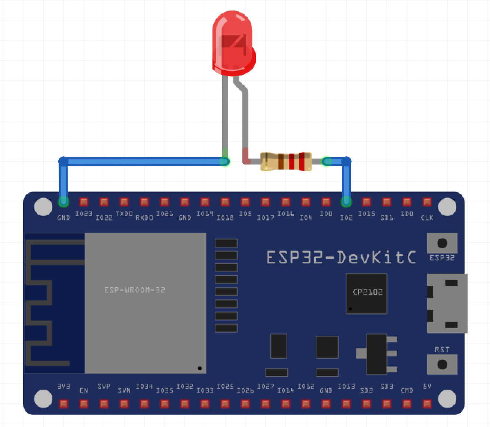

# LINE Things Starter for ESP32

## 必要なもの・開発環境
* [Arduino IDE](https://www.arduino.cc/en/Main/Software)
* [ESP32-DevKitC](https://www.espressif.com/en/products/hardware/esp32-devkitc/overview)
* LED
* 220Ω 抵抗
* Micro-USB to USB ケーブル

## インストール方法
Arduino IDE をインストールた後、必ずボードを **接続しないで** 以下の手順を進めてください。

1. Arduino IDE を開きます
2. **Preferences** を開いてください
3. 'Additional Board Manager URL' に `https://dl.espressif.com/dl/package_esp32_index.json` を追加します
4. Tools -> Board menu　から **Boards Manager** を開いてください
5. "esp32" と検索して、**esp32** をインストールしてください
6. [CP2102 driver](https://www.silabs.com/products/development-tools/software/usb-to-uart-bridge-vcp-drivers) をインストールします

## セットアップ
1. **ESP32-DevKitC** を Micro-USB ケーブルを使って PC へ接続してください
2. Tools -> Board のリストから **ESP32 Dev Module** を選択してください
3. Under Tools -> Port で正しいシリアルポートを選択してください *ie. COM1, /dev/cu.SLAB_USBtoUART*
4. テストとして、一度空のスケッチをアップロードしてみましょう。エラーが出ず、問題がなければ次に進んでください。
5. この sample プロジェクトでは、動作に LED の接続が必要となっています。まず、**IO2** を抵抗の一方に接続し、もう一方を LED のアノード (+側、リードが長い方) に接続してください。その後、LED カソード (-側、リードが短い方) を **Ground** に接続してください。

## アップロード
1. このリポジトリの中から **arduino/sample/sample.ino** を開いてください
2. 必要に応じて、`USER_SERVICE_UUID` を生成された Service UUID に変更してください
3. あとは、アップロードして LINE Things Starter をお楽しみください
