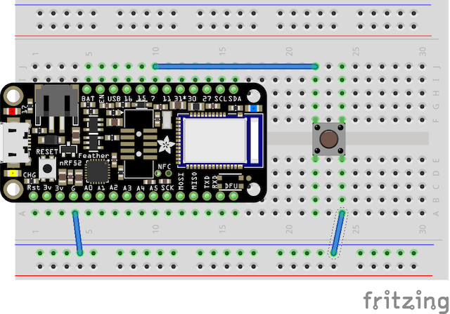

# LINE Things Starter for nRF52

## 必要なもの・開発環境
* [Arduino IDE](https://www.arduino.cc/en/Main/Software)
* [Adafruit Feather nRF52 Bluefruit LE](https://www.adafruit.com/product/3406)
* タクトスイッチ
* Micro-USB to USB ケーブル

## インストール方法
Arduino IDE をインストールた後、必ずボードを **接続しないで** 以下の手順を進めてください。

1. Arduino IDE を開きます
2. **Preferences** を開いてください
3. 'Additional Board Manager URL' に `https://www.adafruit.com/package_adafruit_index.json` を追加します
4. Tools -> Board menu　から **Boards Manager** を開いてください
5. "nRF52" と検索して、**Adafruit nRF52 by Adafruit** をインストールしてください
(*Note: Linux をお使いの方は追加でソフトウェアの設定が必要です、[こちらをご覧ください](https://learn.adafruit.com/bluefruit-nrf52-feather-learning-guide/arduino-bsp-setup)*)
6. [CP2104 driver](https://www.silabs.com/products/development-tools/software/usb-to-uart-bridge-vcp-drivers) をインストールします

## セットアップ
1. **Adafruit Bluefruit nRF52 Feather** を Micro-USB ケーブルを使って PC へ接続してください
2. Tools -> Board のリストから **Adafruit Bluefruit nRF52 Feather** を選択してください
3. Under Tools -> Port で正しいシリアルポートを選択してください *ie. COM1, /dev/cu.SLAB_USBtoUART*
4. テストとして、一度空のスケッチをアップロードしてみましょう。エラーが出ず、問題がなければ次に進んでください。
5. この sample プロジェクトでは、動作にタクトスイッチが必要となっています。**PIN 11** をタクトスイッチの一方に接続し、もう一方を **Ground** に接続してください。

 

## アップロード
1. このリポジトリの中から **arduino/sample/sample.ino** を開いてください
2. 必要に応じて、`USER_SERVICE_UUID` を生成された Service UUID に変更してください
3. あとは、アップロードして LINE Things Starter をお楽しみください
